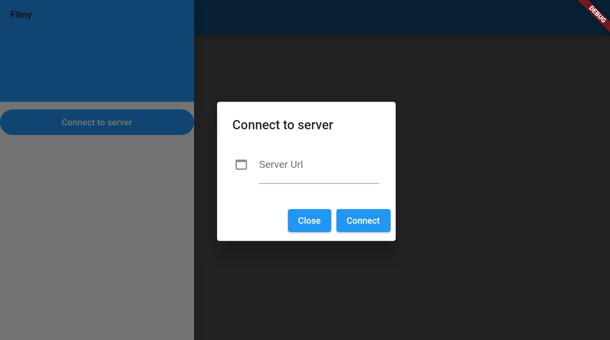
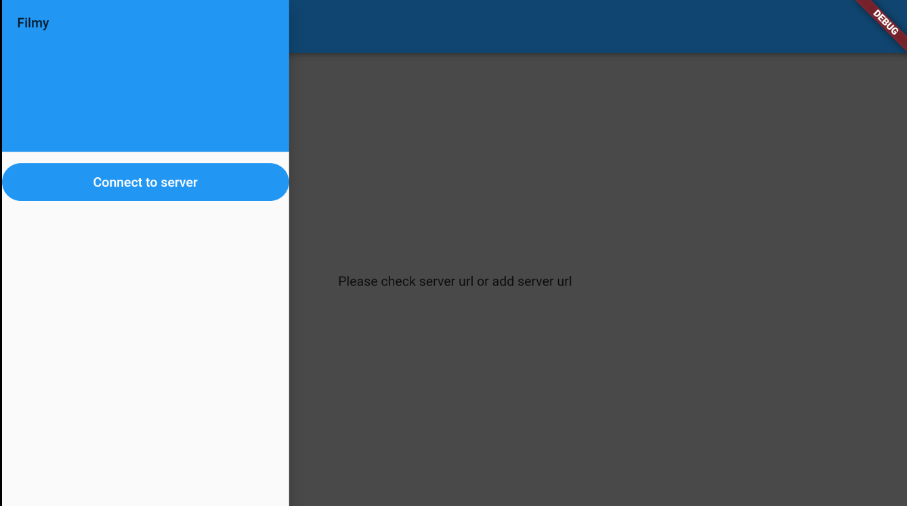

# filmy

Is Android Tv Flutter app, 
 - model of is very basic require 3 properties title, url, coverImage
 - you can generate json file and host over http-server connect the app to watch video/ movies              

## generating apk

  - you can compile flutter apk 
    ``` flutter build apk```


## screenshot 




